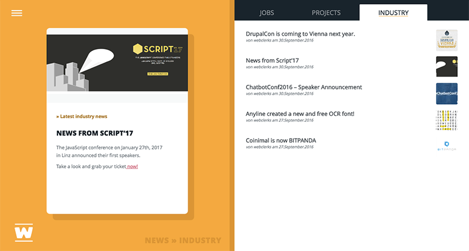
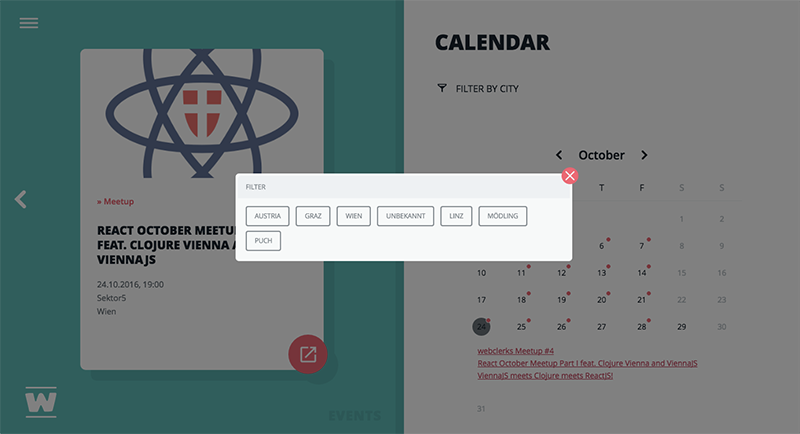
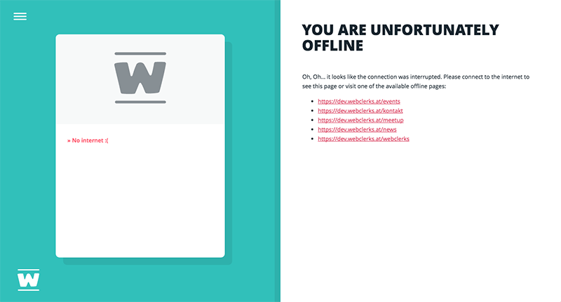
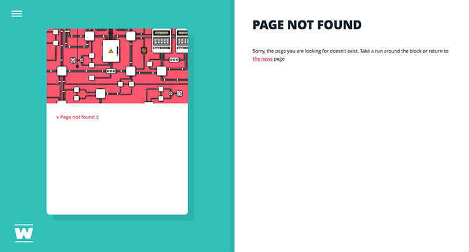
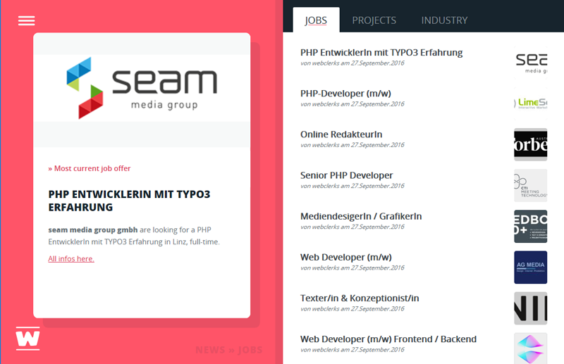
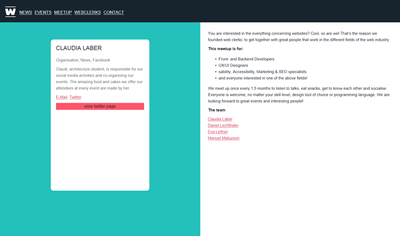
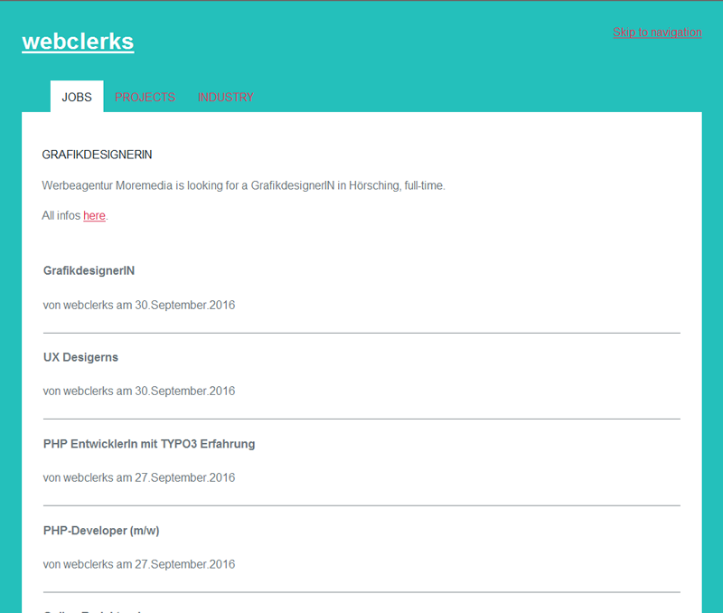
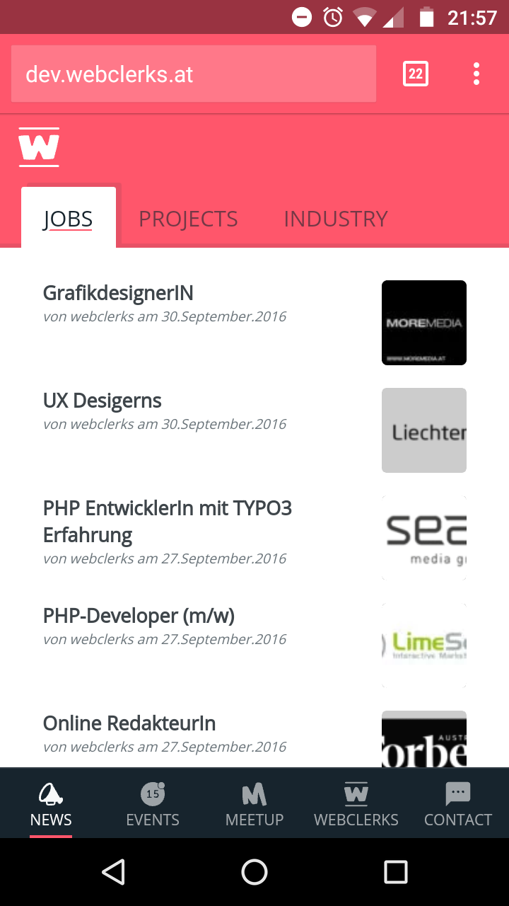

# webclerks10k
Our 10k Apart submission: the webclerks website.

### webclerks

webclerks is a meetup, founded in Vienna, that aims to bring together all professions working on the web in a relaxed and fun setting. We host an event every 1,5 months where we have three talks on various topics, be it programming, design, marketing or content.  We encourage diversity, networking and knowledge sharing during our events and hope to connect people, no matter their profession or skill level.  
And because it's not all about work, we also organise BBQs to get people out of their offices  and play frisbee in the sun.

### Installation

The easiest way to get the website up and running is to simply copy the files from the `dist` directory.

If this is not an option, you have to build the project like this:

* `composer install`
* `npm install`
* `gulp dist`

Then just put the contents of the `dist` directory and the `vendor` directory in one folder.

It is possible that you have to create the folder `app/content/cache` manually and set permissions to `777`.

If you need to check, you'll find a working version here: <https://dev.webclerks.at/>

### Loading of assets
The website works with and without Javascript and caches some pages offline with Service Worker. Each page is smaller than 10KB in weight.

There's critical CSS in every page. If Javascript isn't enabled or if the browser is very old (e.g. IE8) just a basic stylesheet gets linked. No other assets or files are being downloaded. (HTML + critical CSS + basic CSS = <10K) 
If the browser is able of rendering Javascript, another file with enhanced CSS is downloaded and linked via JS. All others assets (images, fonts, icons) are then also downloaded and embeded via JS.  
If the enhanced CSS is already in the browser cache the file will not be downloaded again, but regularly linked with the html `<link>` element.

### Third party code

We wrote all the JS on our own except for three scripts, because there was no way of improving or reducing code for those.

* <https://github.com/aFarkas/html5shiv>
* <https://github.com/filamentgroup/loadCSS>
* <https://github.com/filamentgroup/loadJS>

### a11y

All pages are marked up using HTML5 elements and a11y attributes were they made sense. Each page  may be navigated with keys (tab, arrow) and focus for tabs and modal windows is managed with JS following best practices.

### Screenshots

#### Event page with modal window

#### Offline Error

#### 404

#### News MS Edge

#### webclerks IE9 (noJS)

#### News IE8

#### Android Chrome

